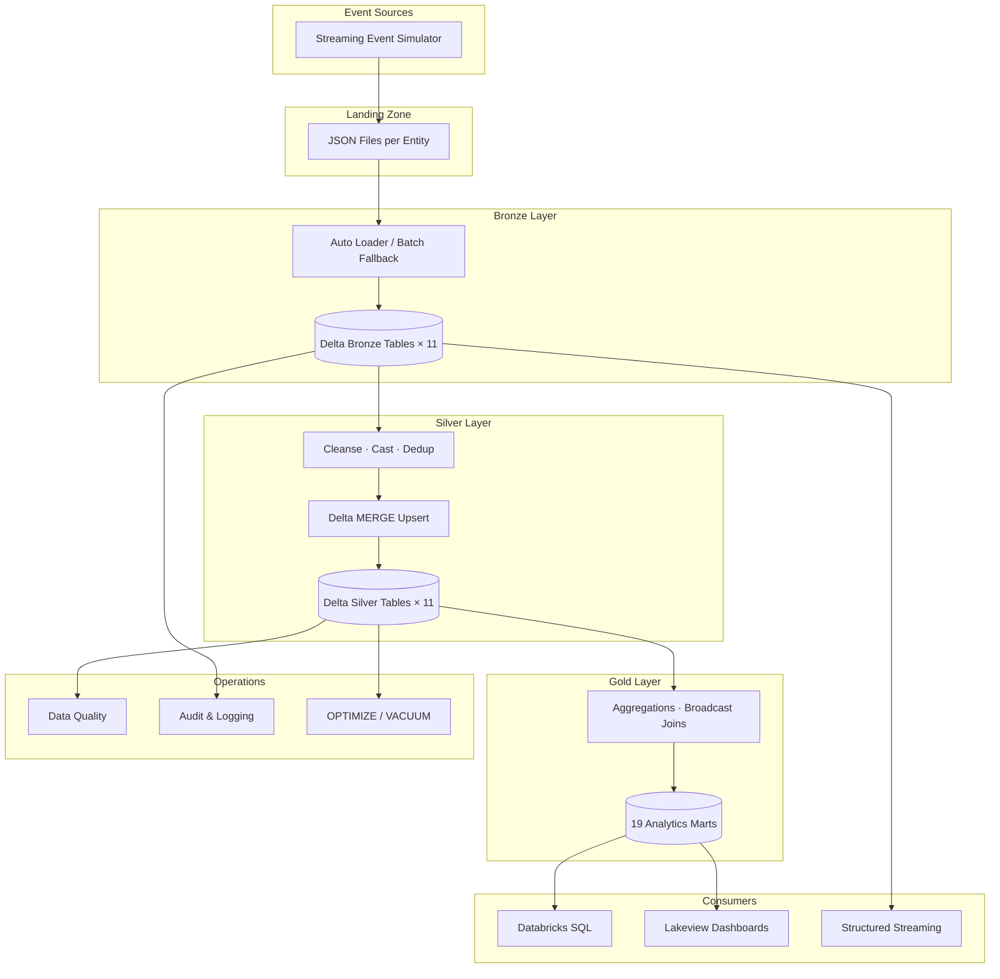
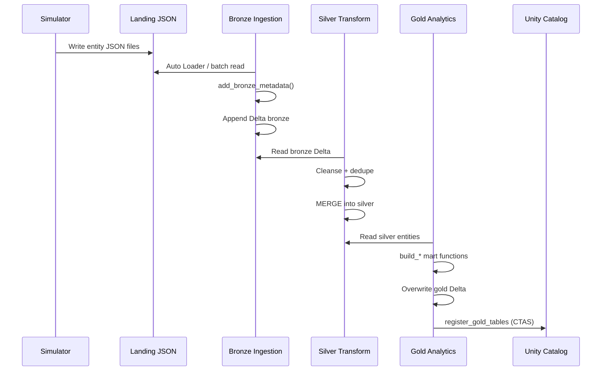
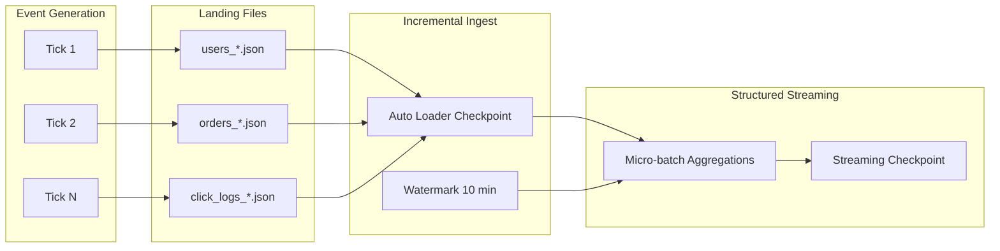
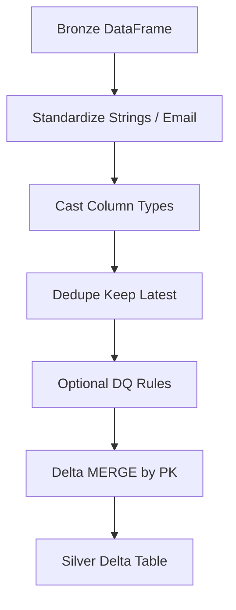
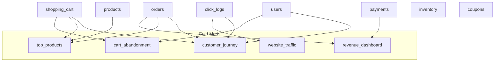
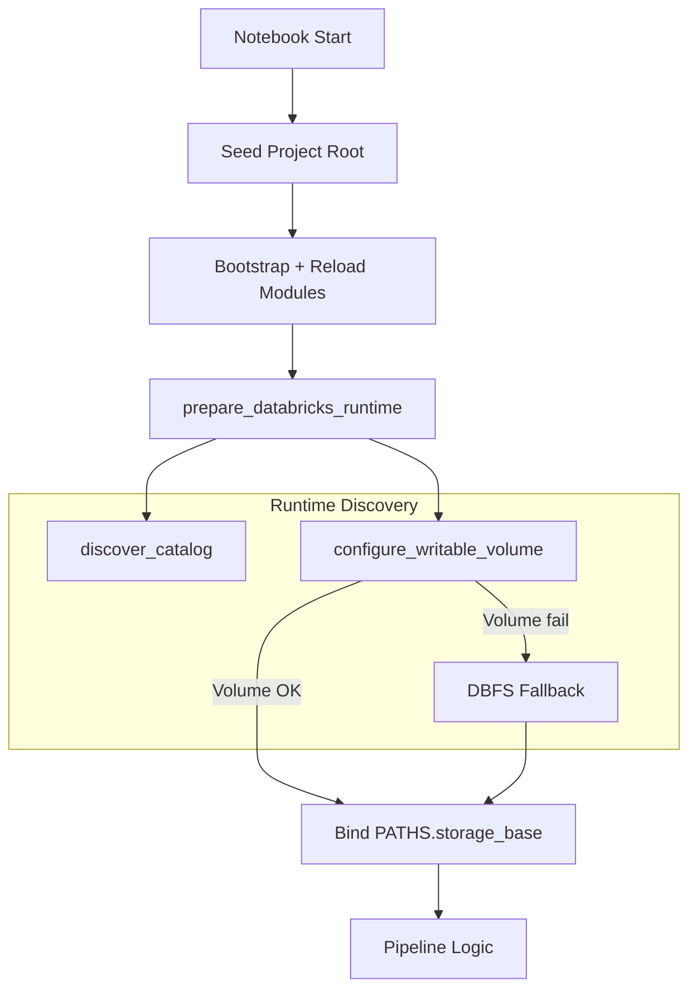

# E-Commerce Lakehouse — Architecture

Enterprise medallion architecture for real-time e-commerce event ingestion, conformed silver entities, and gold analytics marts on Databricks + Delta Lake.

---

## System Context

---

## Medallion Layers

### Bronze — Raw + Lineage

- **Input:** JSON landing files from simulator (or external producers)
- **Ingestion:** Databricks Auto Loader (`cloudFiles`) with schema evolution, rescue column, checkpoints
- **Fallback:** Batch `spark.read.json()` when Auto Loader unavailable
- **Metadata columns:** `_ingestion_time`, `_source_file`, `_load_id`, `_batch_id`, `_record_hash`, `_event_time`
- **Storage:** `{storage_base}/bronze/{entity}`

### Silver — Conformed Entities

- **Transforms:** Trim strings, cast types, dedupe by primary key (keep latest event time)
- **Upsert:** Delta MERGE on entity primary keys (`ENTITY_PRIMARY_KEYS` in constants)
- **Output:** 11 conformed Delta tables at `{storage_base}/silver/{entity}`
- **Quality gates:** Optional DQ validation before/after merge

### Gold — Business Analytics

- **Pattern:** Read silver → broadcast small dimensions → aggregate → overwrite mart
- **Output:** 19 marts at `{storage_base}/gold/{mart_name}`
- **Registration:** Managed UC tables via CTAS (`register_gold_tables`)

---

## Data Flow

---

## Streaming Flow

**Simulator settings** (configurable via `ECOMMERCE_*`):

- Default: 3 ticks, 25 events per entity per tick, 60s interval between ticks
- FK coherence: shared user/product/order/session ID pools within a tick

**Structured streaming notebook** (`Streaming/01_structured_streaming.py`):

- Reads bronze or silver click/order streams
- Applies watermark for late-arrival handling
- Writes aggregated metrics to streaming checkpoint paths

---

## Transformation Flow (Silver)

Primary keys per entity are defined in `config/constants.py` (`ENTITY_PRIMARY_KEYS`).

---

## Transformation Flow (Gold)

Each mart builder in `src/transformations/gold_transforms.py` gracefully skips when required silver sources are missing.

---

## Runtime & Storage Architecture

**Storage priority:**

1. `ECOMMERCE_STORAGE_BASE` env override (if set)
2. UC Volume: `/Volumes/{catalog}/{schema}/ecommerce_lakehouse`
3. DBFS fallback: `dbfs:/FileStore/ecommerce_lakehouse`

---

## Optimization Strategy

| Technique | Where Applied | Config Gate |
|-----------|---------------|---------------|
| **AQE** | All Spark jobs | Always on (`SparkConfig.enable_aqe`) |
| **Broadcast joins** | Gold dimension joins (users, products) | Automatic via `F.broadcast()` |
| **Delta optimizeWrite / autoCompact** | All Delta writes | Spark conf defaults |
| **ZORDER** | Silver/bronze entity tables | `ECOMMERCE_ZORDER_ENABLED` |
| **OPTIMIZE** | Monitoring notebook | `ECOMMERCE_OPTIMIZE_ENABLED` |
| **VACUUM** | Monitoring notebook | `ECOMMERCE_VACUUM_ENABLED` |
| **Liquid clustering** | Optional table alteration | `ECOMMERCE_LIQUID_CLUSTERING_ENABLED` |
| **Partitioning** | Bronze `ingestion_date` generated column | Per entity in autoloader |
| **Caching** | Gold build hot silver tables | `.cache()` + `.count()` in gold_transforms |

ZORDER column mappings per entity: `OPTIMIZE_ZORDER_COLUMNS` in `config/constants.py`.

---

## Governance & Observability

| Component | Path / Table | Purpose |
|-----------|--------------|---------|
| Pipeline audit | `{storage_base}/audit/pipeline_audit` | Step timing, row counts, status |
| Structured logs | `{storage_base}/ops_logging/pipeline_logs` | INFO/WARN/ERROR with context |
| DQ results | `{storage_base}/data_quality/validation_results` | Rule pass/fail metrics |
| Failed records | `{storage_base}/data_quality/failed_records` | Quarantined row payloads |
| Dead letter | `{storage_base}/dead_letter/{entity}` | Ingestion failures |
| Quarantine | `{storage_base}/quarantine/{entity}` | DQ-failed silver rows |

UC registration maps ops tables under `audit`, `ops_logging`, and `data_quality` schemas.

---

## Security & Portability Principles

1. **No hardcoded catalog** — discovered at runtime
2. **No writes to Git** — cloud storage binding on Databricks
3. **No destructive FS deletes** — Delta-native soft reset
4. **Idempotent MERGE** — safe replays and backfills
5. **Parameterized SQL** — `{{CATALOG}}` templates for manual ops

See [../COMPATIBILITY_REPORT.md](../COMPATIBILITY_REPORT.md) for the full portability audit.
