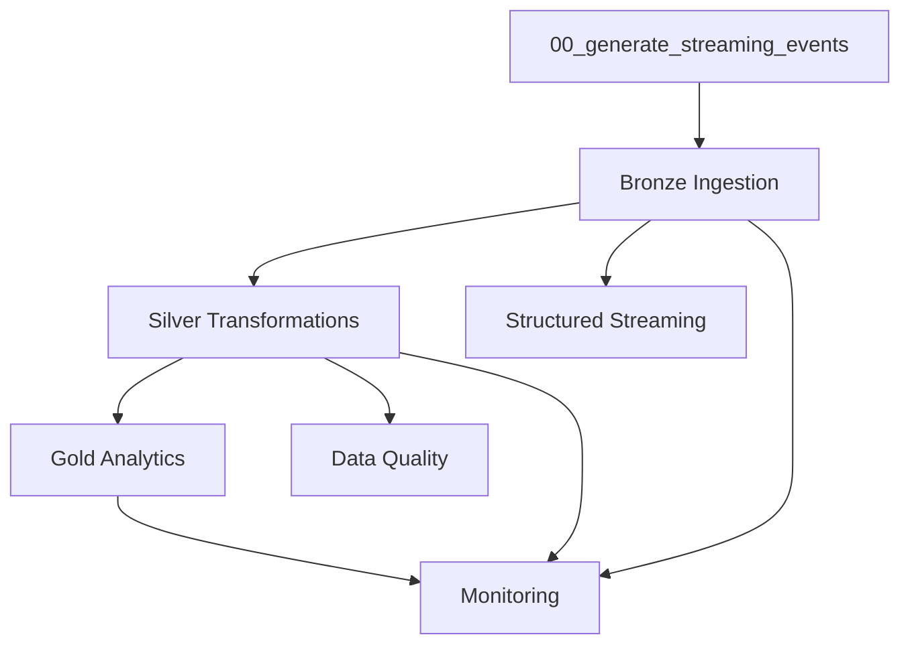

# Notebook Execution Flow

Step-by-step execution guide for the E-Commerce Lakehouse notebooks, including dependencies and expected outputs.

---

## Orchestrated Run (Recommended)

**Notebook:** `notebooks/00_run_all_pipelines.py`

Runs all pipeline stages sequentially via `dbutils.notebook.run()`:

| Step | Notebook | Key |
|------|----------|-----|
| 1 | `./00_generate_streaming_events` | `generate_events` |
| 2 | `./Bronze/01_bronze_ingestion` | `bronze` |
| 3 | `./Silver/01_silver_transformations` | `silver` |
| 4 | `./Gold/01_gold_analytics` | `gold` |
| 5 | `./Streaming/01_structured_streaming` | `streaming` |
| 6 | `./DataQuality/01_data_quality_framework` | `data_quality` |
| 7 | `./Monitoring/01_monitoring_maintenance` | `monitoring` |

**Prerequisites:** Serverless or DBR 13.3+ cluster attached; repo cloned with `config/config.py` discoverable.

**Fallback:** If `dbutils` is unavailable (local), run `python scripts/run_local_pipeline.py` instead.

---

## Step 1 — Generate Streaming Events

**Notebook:** `notebooks/00_generate_streaming_events.py`

| Item | Detail |
|------|--------|
| **Purpose** | Produce realistic JSON event files for all 11 entities |
| **Module** | `src/ingestion/streaming_simulator.py` |
| **Depends on** | `prepare_databricks_runtime()` (Volume/DBFS bound) |
| **Produces** | Files under `{storage_base}/landing/json/{entity}/` |
| **Default volume** | 3 ticks × 25 events × 11 entities |

**Validation:**

```python
from config.constants import ALL_ENTITIES
from config.paths import PATHS
for e in ALL_ENTITIES:
    print(e, PATHS.landing_path(e))
```

---

## Step 2 — Bronze Ingestion

**Notebook:** `notebooks/Bronze/01_bronze_ingestion.py`

| Item | Detail |
|------|--------|
| **Purpose** | Incrementally ingest landing JSON into Bronze Delta |
| **Module** | `src/ingestion/autoloader.py` |
| **Depends on** | Step 1 (landing files exist) |
| **Produces** | `{storage_base}/bronze/{entity}` (11 tables) |
| **Mechanism** | Auto Loader (`cloudFiles`) → batch fallback |

**Metadata added:** `_ingestion_time`, `_source_file`, `_load_id`, `_batch_id`, `_record_hash`, `_event_time`

**Post-step (optional):** `register_bronze_tables(spark, cfg)`

---

## Step 3 — Silver Transformations

**Notebook:** `notebooks/Silver/01_silver_transformations.py`

| Item | Detail |
|------|--------|
| **Purpose** | Cleanse, dedupe, MERGE upsert into Silver |
| **Module** | `src/transformations/silver_transforms.py` |
| **Depends on** | Step 2 (bronze Delta exists) |
| **Produces** | `{storage_base}/silver/{entity}` (11 tables) |
| **Mechanism** | Delta MERGE on entity primary keys |

**Post-step (optional):** `register_silver_tables(spark, cfg)`

---

## Step 4 — Gold Analytics

**Notebook:** `notebooks/Gold/01_gold_analytics.py`

| Item | Detail |
|------|--------|
| **Purpose** | Build 19 gold analytics marts |
| **Module** | `src/transformations/gold_transforms.py` |
| **Depends on** | Step 3 (silver entities; partial marts skip if sources missing) |
| **Produces** | `{storage_base}/gold/{mart_name}` |
| **Mechanism** | Overwrite Delta + optional UC registration |

**Post-step:** `register_gold_tables(spark, cfg)` or `register_all_layers(spark, cfg)`

---

## Step 5 — Structured Streaming

**Notebook:** `notebooks/Streaming/01_structured_streaming.py`

| Item | Detail |
|------|--------|
| **Purpose** | Demonstrate streaming aggregations on click/order events |
| **Depends on** | Steps 1–2 (ongoing events) or existing bronze data |
| **Config** | Watermark: `ECOMMERCE_STREAM_WATERMARK` (default 10 min) |
| **Produces** | Streaming checkpoints under `{storage_base}/streaming/_checkpoints/` |

Can run concurrently with simulator ticks for live demo scenarios.

---

## Step 6 — Data Quality Framework

**Notebook:** `notebooks/DataQuality/01_data_quality_framework.py`

| Item | Detail |
|------|--------|
| **Purpose** | Execute DQ rules on silver entities |
| **Module** | `src/utilities/data_quality.py` |
| **Depends on** | Step 3 (silver data) |
| **Produces** | Validation results + quarantined failed records |
| **Rules** | Not null, unique, in-set, range, FK, positive, late-event |

---

## Step 7 — Monitoring & Maintenance

**Notebook:** `notebooks/Monitoring/01_monitoring_maintenance.py`

| Item | Detail |
|------|--------|
| **Purpose** | OPTIMIZE, VACUUM, time travel demo, audit summary |
| **Module** | `src/utilities/delta_helpers.py` |
| **Depends on** | Steps 2–4 (Delta tables exist) |
| **Config gates** | `ECOMMERCE_OPTIMIZE_ENABLED`, `ECOMMERCE_VACUUM_ENABLED`, `ECOMMERCE_ZORDER_ENABLED` |

Uses `soft_reset_delta_path()` for idempotent demos — never recursive filesystem delete.

---

## Dependency Graph



**Parallel-safe:** Step 5 (Streaming) can overlap with Steps 3–4 if bronze is continuously fed.

---

## Bootstrap Sequence (Every Notebook)

All notebooks execute this sequence before business logic:

```python
# 1. Seed project root (marker: config/config.py)
_PROJECT_ROOT = _seed_project_root()

# 2. Bootstrap + reload modules
from src.utilities.bootstrap import bootstrap_notebook
bootstrap_notebook(dbutils=dbutils, reload_modules=True)

# 3. Runtime prep
from config.config import get_config
from src.utilities.databricks_runtime import prepare_databricks_runtime

spark = globals().get("spark") or SparkSession.getActiveSession()
cfg = prepare_databricks_runtime(spark, get_config())
```

---

## Local Pipeline Equivalent

`scripts/run_local_pipeline.py` mirrors the notebook sequence for CI/local dev:

1. Generate simulator events (local `data/` paths)
2. Bronze batch ingestion
3. Silver MERGE
4. Gold marts
5. Skip streaming (or optional)
6. DQ validation
7. Skip maintenance (config-gated)

Run tests after local pipeline:

```bash
pytest tests/integration/test_gold_smoke.py -q
```

---

## Databricks Job Template

`notebooks/databricks_job.json` defines a multi-task workflow template. Update `notebook_path` to match your workspace clone location. No catalog or volume values are embedded — notebooks discover runtime environment automatically.

---

## Troubleshooting

| Symptom | Likely Cause | Fix |
|---------|--------------|-----|
| `Databricks_pipeline root not found` | Notebook outside repo tree | Set `ECOMMERCE_LAKEHOUSE_ROOT` |
| `No active SparkSession` on Databricks | Cluster not attached | Attach Serverless/cluster |
| Auto Loader fails silently | Serverless restriction | Batch fallback runs automatically |
| Gold marts SKIPPED | Silver source missing | Re-run Bronze + Silver |
| Volume create denied | UC policy | Set `ECOMMERCE_STORAGE_BASE` or use DBFS fallback |
| Stale code after Git pull | Module cache | Re-run first cell (reload_modules=True) |
